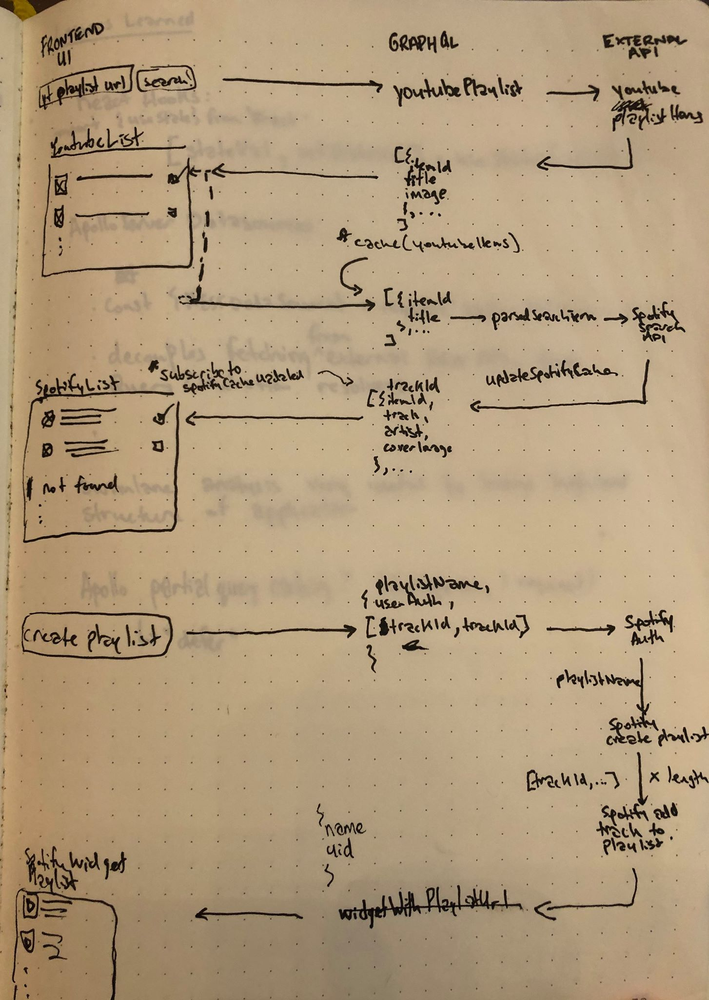

  <h3 class="project-section-title">summary</h3>
  

    

      The project converts a youtube playlist to a spotify playlist. The user
      enters the url of a youtube playlist, and a spotify playlist containing
      the same songs is created.
    

  

  <h3 class="project-section-title">objectives</h3>
  

    

      This project was executed with a few key objectives in mind:
    

    <ul>
      <li>Strengthen my graphQL/Apollo Server proficiency</li>
      <li>Gain more experience working with RESTful APIs</li>
      <li>Gain experience developing in a team environment</li>
    </ul>
  

  <h3 class="project-section-title">achievements/lessons</h3>
  

    

      I'm super happy with how the project turned out (even though we didn't
      really build a proper frontend) given the fact that we did it all in one
      weekend. Here are some things I'm proud of with respect to this project:
    

    <ul>
      <li>
        <strong>Seriously leveled up my Apollo Server/GraphQL skills.</strong>
        My friend had never touched GraphQL before so there were a lot of times
        that I acted as a mentor for her. By teaching her GraphQL I was able to
        deepen my own understanding of it. Through this project I also learnt to
        use the Apollo
        <a
          href="https://www.apollographql.com/docs/apollo-server/data/data-sources/"
          title="Apollo RESTDataSource Documentation"
          rel="noopener noreferrer"
          target="_blank"
          >RESTDataSource</a
        >
        package. RESTDataSource helped us organize our spotify and youtube API
        calls + data cleanup/reduction, resulting in much cleaner Query
        resolvers.
      </li>
      <li>
        <strong>Got better at using git.</strong> When working on a new feature,
        I learnt to create a branch for that feature to be merged with the
        master branch later.
      </li>
      <li>
        <strong>Got cozy with peer programming.</strong> When one person gets
        stuck it really helps to get a fresh pair of eyes on the issue.
      </li>
      <li>
        <strong>Improved my Regex skills.</strong> One of the challenges with
        this project was that the titles of youtube videos often include things
        like [OFFICIAL VIDEO], or (audio),
        <a
        tabindex="0"
          href="http://tinyurl.com/yxgocub8"
          title="Regex visualization"
          target="_blank"
          rel="noopener noreferrer"
          >or any number of other things
          🤯</a
        >. I used regex to find noise in the titles and removed it so that they
        could effectively be used to hit the Spotify search API to get the
        corresponding Spotify Track.
      </li>
      
      <li>
        <strong>Organized the project.</strong> During a lunch break, we drew
        out a swimlane analysis diagram (above) to show the dataflow between the
        frontend, the GraphQL server, and the external APIs. This allowed our
        team to visualize the entire project so that we could split up the work
        effectively.
      </li>
      <li>
        <strong
          >Embodied Captain Hook.⚓</strong
        >
        I became much more familiar with React hooks -- specifically useState,
        and useQuery (Apollo)
      </li>
    </ul>

  

  <h3 class="project-section-title">next steps</h3>
  

    

      Like many weekend hackathon projects, this thing is far from finished.
      Here are some things left to do:
    

    <ul>
      <li><strong>Finish building the frontend.</strong></li>
      <li>
        <strong>Look into GraphQL subscriptions</strong> to eliminate one trip
        between the client and the server. Somewhere in our exhaustion during
        the hackathon I crafted
        <a
        tabindex="0"
          href="https://stackoverflow.com/questions/58151433/send-1-request-receive-2-responses-graphql"
          title="Send 1 request, Receive 2 Responses GraphQL StackOverflow question"
          rel="noopener noreferrer"
          target="_blank"
          >this beauty of a stackoverflow question who's title sounds like some
          kind of clickbait marketing
          😂</a
        >. Amazingly, someone understood what I was trying to ask (probably from
        the high-fidelity microsoft paint diagram) and pointed me in the right
        direction.
      </li>
      <li>
        <strong>Build auth flow.</strong> If this project were to move to
        production, we would definitely add an authorization flow. At the
        moment, we got an authorization token from Spotify that allowed our app
        to access our own Spotify account to create + name a new playlist and
        add songs to the playlist
      </li>
    </ul>
  

